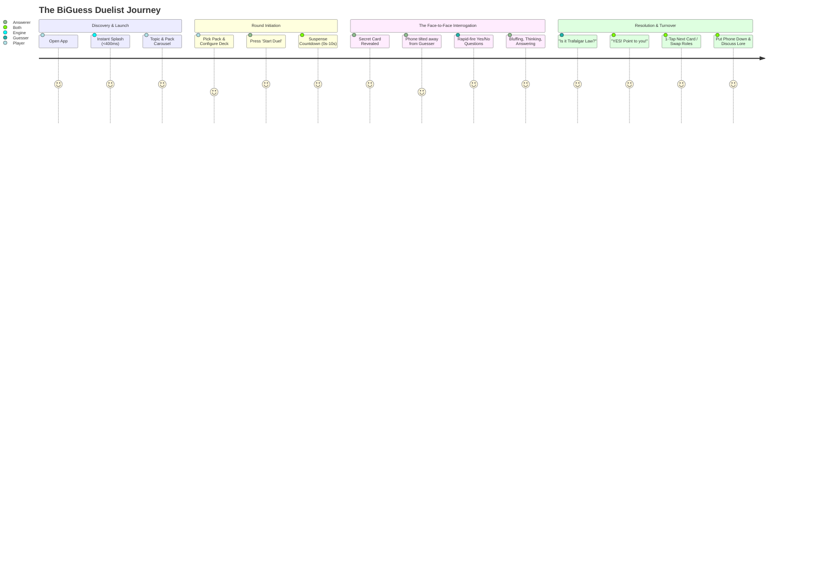

# 🎮 BiGuess — Product Blueprint & Master North Star
*The Definitive Architectural & Strategic Specification for the Next Generation of Face-to-Face Social Deduction*

---

## 📑 Table of Contents

1. [Executive Vision & Purpose](#1-executive-vision--purpose)
2. [Uncompromising Product Principles](#2-uncompromising-product-principles)
3. [The End-to-End User Experience (UX Journey)](#3-the-end-to-end-user-experience-ux-journey)
4. [The Universal Game Model (`Topic → Pack → Card`)](#4-the-universal-game-model-topic--pack--card)
5. [Content System & Asset Pipeline at Scale](#5-content-system--asset-pipeline-at-scale)
6. [Technical Architecture & Engineering Boundaries](#6-technical-architecture--engineering-boundaries)
7. [The Content Studio (Empowering Non-Developers)](#7-the-content-studio-empowering-non-developers)
8. [Distribution, Packaging & Live OTA Updates](#8-distribution-packaging--live-ota-updates)
9. [Infrastructure, Operational & Scaling Costs](#9-infrastructure-operational--scaling-costs)
10. [Intellectual Property, Legal & Fair Use Posture](#10-intellectual-property-legal--fair-use-posture)
11. [Business Model & Sustainable Monetization](#11-business-model--sustainable-monetization)
12. [The Modernized MVP Specification](#12-the-modernized-mvp-specification)
13. [Long-Term Product Evolution & Future Horizons](#13-long-term-product-evolution--future-horizons)
14. [Actionable Migration Plan from Legacy BiGuess](#14-actionable-migration-plan-from-legacy-biguess)

---

## 1. Executive Vision & Purpose

### 🌟 Why BiGuess Exists
In an era dominated by isolated screen staring, hyper-monetized gacha mechanics, and solitary multiple-choice trivia clones, mobile gaming has increasingly disconnected people sitting in the same room.

**BiGuess exists to be a catalyst for genuine face-to-face human interaction.**

It takes the timeless, electric psychology of classic parlor deduction games (*"20 Questions"*, *"Guess Who?"*, *"Hedbanz"*) and supercharges it with the rich, expansive lore of modern pop-culture, anime, cinema, gaming, and sports fandoms.

```
       ┌─────────────────────────────────────────────────────────┐
       │                   THE BIGUESS PARADIGM                  │
       │                                                         │
       │     The smartphone is NOT an isolating screen.         │
       │     It is a digital card deck placed on the table       │
       │     between two human beings looking into each other's  │
       │     eyes, bluffing, deducing, and laughing.             │
       └─────────────────────────────────────────────────────────┘
```

### 🎯 The Core Problem We Solve
- **Trivia apps are solitary and boring:** Multiple-choice tapping tests rote memory without dialogue or social banter.
- **Physical card games lack scale & portability:** You cannot carry 2,000 anime cards in your pocket to a coffee shop, convention floor, or classroom.
- **Existing digital party games require complex setups:** Many require continuous high-speed Wi-Fi, 4+ players, or painful room codes that kill spontaneous play.

### 🚀 The BiGuess Promise
Two friends anywhere on Earth—on a subway, in a noisy convention hall, at a camping site, or at a university cafeteria—can pull out a single phone, pick a shared passion, and dive into an intense psychological duel within 3 seconds, with **zero internet required**.

---

## 2. Uncompromising Product Principles

These are the non-negotiable rules governing every design, engineering, and content decision made for BiGuess. If a proposed feature violates these principles, it will not be built.

```
┌───────────────────────────┬───────────────────────────────────────────────────────────────────────────────┐
│ PRINCIPLE                 │ WHAT IT MEANS IN PRACTICE                                                     │
├───────────────────────────┼───────────────────────────────────────────────────────────────────────────────┤
│ 1. Zero-Latency Physical  │ Gameplay is 100% offline-first. Instant local card pulls. Zero spinner wheels  │
│    Presence               │ or loading dialogs during a duel.                                             │
├───────────────────────────┼───────────────────────────────────────────────────────────────────────────────┤
│ 2. Screen as a Medium,    │ The UI is glanceable. Players spend 95% of the round making eye contact,      │
│    Not a Destination      │ asking questions, and reading human reactions, not fiddling with menus.        │
├───────────────────────────┼───────────────────────────────────────────────────────────────────────────────┤
│ 3. Content Sanctity &     │ Every card is canon-accurate, high-resolution, beautifully cropped, and       │
│    Curation Quality       │ multilingual. Low-quality art or misspelled names are treated as fatal bugs.  │
├───────────────────────────┼───────────────────────────────────────────────────────────────────────────────┤
│ 4. Zero Anti-Consumer     │ No forced video ads between rounds, no artificial energy/stamina bars, no     │
│    Mechanics              │ mandatory sign-ins just to play locally with a friend.                        │
├───────────────────────────┼───────────────────────────────────────────────────────────────────────────────┤
│ 5. Universal Modularity   │ The game engine is domain-agnostic. The same core handles Anime, Premier      │
│                           │ League Football, Marvel MCU, World History, or Medical Anatomy.              │
├───────────────────────────┼───────────────────────────────────────────────────────────────────────────────┤
│ 6. Featherweight Battery  │ Target 60/120 FPS fluid rendering with ultra-low memory footprint (<80MB RAM) │
│    & Storage Footprint    │ and compact compressed assets (<12 KB per card).                              │
└───────────────────────────┴───────────────────────────────────────────────────────────────────────────────┘
```

---

## 3. The End-to-End User Experience (UX Journey)

The BiGuess UX is engineered for rapid time-to-fun, physical comfort, and organic conversational flow.



### 🪜 Step-by-Step Experience Blueprint

#### Phase 1: Spontaneous Spark & Zero-Barrier Launch
- **Real-World Context:** Friend A asks Friend B: *"How well do you actually know Attack on Titan?"*
- **App Launch:** Friend A taps the BiGuess icon.
- **Launch Budget:** Splash to interactive Home screen in **< 400 milliseconds**. No popups, no account prompts, no rating requests.

#### Phase 2: Tactical Deck & Pack Selection
- **Visual Presentation:** Clean, dark-mode glassmorphic category cards showcasing franchise art, total card count, and tag pills.
- **Deck Setup (Instant Sheet / In-Game Quick Settings):**
  - **Shuffle Mode:** *Fair Non-Repeating (exhaust complete deck before repeat)* vs *Pure Random*.
  - **Suspense Ticker:** `Instant (0s)`, `1s`, `2s`, `3s`, `5s`, or `10s`.
  - **Hint Badges:** *On* (displays name + tags for novice Answerers) or *Hardcore Off* (artwork only).

#### Phase 3: The Duel & Physical Ergonomics
1. **The Hand-Off:** The Answerer holds the phone facing themselves (or places it propped up facing them, away from the Guesser).
2. **The Roll:** The Answerer taps the interactive action trigger.
3. **The Suspense Build:** A dynamic radial countdown ticks down with tactile haptic pulses.
4. **The Secret Reveal:** The high-resolution mystery card appears with an interactive 3D perspective tilt reacting to device micro-movements.
5. **The Interrogation Protocol:**
   - Guesser asks strict canonical questions: *"Are they a Devil Fruit user?"*, *"Did they survive the Chimera Ant arc?"*, *"Are they a captain?"*
   - Answerer responds with **"Yes"**, **"No"**, or **"Irrelevant / Ambiguous"**.
   - No peeking, no multiple-choice hints. Pure human deduction.

#### Phase 4: Deduction, Scoring & Rapid Turnover
- The Guesser locks in their final answer.
- On success: Answerer reveals the screen. Points are awarded with an intuitive 1-tap score counter.
- On miss: Guesser can either forfeit or pass to the next question based on house rules.
- **Instant Next Round:** 1-tap on the card cycles to the next secret character immediately.

#### Phase 5: Natural Session Ending
- Match summary with round history, played deck progress, and score recap.
- Players put the phone down, energized by the real conversation and friendly debates sparked during play.

---

## 4. The Universal Game Model (`Topic → Pack → Card`)

To scale from hundreds of anime characters to hundreds of thousands of pop-culture, gaming, sports, and educational cards, BiGuess adopts a rigid, standardized 3-tier object taxonomy.

```
                               ┌───────────────────────────────┐
                               │             TOPIC             │
                               │  (Domain / Super-Category)    │
                               │  e.g., Anime, Gaming, Sports  │
                               └───────────────┬───────────────┘
                                               │ 1-to-Many
                                               ▼
                               ┌───────────────────────────────┐
                               │             PACK              │
                               │  (Curated Deck / Franchise)   │
                               │  e.g., One Piece, Premier Lg  │
                               └───────────────┬───────────────┘
                                               │ 1-to-Many
                                               ▼
                               ┌───────────────────────────────┐
                               │             CARD              │
                               │  (Atomic Deduction Entity)    │
                               │  e.g., Trafalgar Law, Messi   │
                               └───────────────────────────────┘
```

### 📦 Entity Specifications

#### 1. Topic (Domain Entity)
```json
{
  "id": "anime_manga",
  "title": { "en": "Anime & Manga", "ar": "أنمي ومانغا", "fr": "Anime & Manga" },
  "icon": "sparkles",
  "colorAccent": "#6750A4",
  "description": "Legendary shonen, seinen, and classic animated universes",
  "order": 1,
  "isActive": true
}
```

#### 2. Pack (Deck Entity)
```json
{
  "id": "one_piece",
  "topicId": "anime_manga",
  "name": { "en": "One Piece", "ar": "ون بيس", "ja": "ワンピース" },
  "description": "Grand Line pirates, Marines, World Government, and Revolutionary Army",
  "version": "1.4.0",
  "cardCount": 466,
  "bannerAsset": "assets/logos/one_piece.webp",
  "isCore": true,
  "isDownloadable": false,
  "downloadSizeKb": 4820,
  "tags": ["Shonen", "Pirates", "Powers", "High-Difficulty"],
  "rulesCustomization": {
    "defaultCountdownSeconds": 3,
    "suggestedTimeLimitSeconds": 60
  }
}
```

#### 3. Card (Atomic Item Entity)
```json
{
  "id": "op_trafalgar_d_water_law",
  "packId": "one_piece",
  "names": {
    "en": "Trafalgar D. Water Law",
    "ar": "ترافالغار دي واتر لاو",
    "ja_romaji": "Torafarugā Dī Wātā Rō",
    "ja_kanji": "トラファルガー・D・ワーテル・ロー",
    "aliases": ["Surgeon of Death", "Law", "Tora-o"]
  },
  "image": {
    "uri": "assets/images/one_piece/Trafalgar D. Water Law.webp",
    "width": 600,
    "height": 800,
    "aspectRatio": 0.75,
    "hash": "e3b0c44298fc1c149afbf4c8996fb92427ae41e4649b934ca495991b7852b855",
    "dominantColor": "#2C3E50"
  },
  "attributes": {
    "gender": "male",
    "affiliation": ["Heart Pirates", "Worst Generation", "Seven Warlords (Former)"],
    "origin": "North Blue",
    "powerUser": true,
    "powerType": "Ope Ope no Mi (Paramecia)",
    "bounty": 3000000000,
    "status": "alive"
  },
  "difficulty": "medium",
  "curator": {
    "author": "Anas Oussama DJRIBIE",
    "verifiedBy": "Abderrahmane SAOUDI",
    "verifiedDate": "2026-08-25"
  }
}
```

---

## 5. Content System & Asset Pipeline at Scale

Creating and maintaining tens of thousands of cards across multiple topics requires a strict, automated ingestion and quality-assurance pipeline.

```
 ┌────────────────┐     ┌────────────────┐     ┌────────────────┐     ┌────────────────┐
 │ 1. INGESTION   │ ──> │ 2. OPTIMIZE    │ ──> │ 3. LINT & AUDIT│ ──> │ 4. CODE-GEN    │
 │ Raw image &    │     │ WebP conversion│     │ Casing, typos, │     │ Static manifest│
 │ naming payload │     │ EXIF stripped  │     │ pHash dupes    │     │ & bundle sync  │
 └────────────────┘     └────────────────┘     └────────────────┘     └────────────────┘
```

### 🛡️ Mandatory Content Ingestion Standards

| Metric | Target Specification | Enforcement Mechanism |
| :--- | :--- | :--- |
| **Image Format** | WebP (lossy @ 82% quality, alpha preserved) | `scripts/convert_and_optimize.py` |
| **Max Dimensions** | Max 600px width / 800px height | PIL / Pillow auto-rescale |
| **File Size Cap** | Maximum 18 KB per card (Average: 8–10 KB) | `scripts/audit_assets.py` build gate |
| **Aspect Ratio** | 3:4 portrait or 1:1 square cropped | Studio auto-framing grid |
| **Text Normalization** | Unicode NFC encoding (preserving accents: `é`, `û`, Arabic) | `scripts/normalize_filenames.py` |
| **Duplicate Prevention** | Levenshtein name distance & perceptual image hashing (pHash) | `scripts/character_stats.py` |
| **Canon Validation** | Dual-human verification required for official core packs | Peer review sign-off in metadata |

---

## 6. Technical Architecture & Engineering Boundaries

We adhere strictly to technology justified by our product requirements: no microservice sprawl, no complex backend dependencies for offline play, and clean decoupling.

```
┌─────────────────────────────────────────────────────────────────────────────────────────┐
│                                   PRESENTATION LAYER                                    │
│       Screens (Categories, Game Arena, Pack Explorer) • Micro-Animation Widgets         │
│          Riverpod 2.x StateNotifiers (GameController, Settings, Updater, Pack)          │
└────────────────────────────────────────────┬────────────────────────────────────────────┘
                                             │
┌────────────────────────────────────────────▼────────────────────────────────────────────┐
│                                     DOMAIN LAYER                                        │
│        Entities (Topic, Pack, Card, GameState) • Contracts (IPackRepository)           │
│        Use Cases (SelectNextCardUseCase, FilterPacksUseCase, ManageScoreUseCase)        │
└────────────────────────────────────────────▲────────────────────────────────────────────┘
                                             │
┌────────────────────────────────────────────┴────────────────────────────────────────────┐
│                                      DATA LAYER                                         │
│   Bundled Static Manifest  │  Local Pack Storage (Isar/SQLite)  │  Remote CDN Pack Sync │
└────────────────────────────────────────────┬────────────────────────────────────────────┘
                                             │
┌────────────────────────────────────────────▼────────────────────────────────────────────┐
│                                CORE & SERVICES LAYER                                    │
│   Material 3 Theming Engine • Shorebird OTA Patch Engine • Native APK Installer • Haptics│
└─────────────────────────────────────────────────────────────────────────────────────────┘
```

### 🛠️ Approved Technology Stack

- **Client Runtime:** Flutter 3.x / Dart 3.x (Declarative, compile-to-native, 120Hz canvas).
- **State Management:** `flutter_riverpod: ^2.6.1` (Zero boilerplate, compile-safe, fully testable).
- **Local Persistence & Caching:** `shared_preferences` (settings) + lightweight binary pack store.
- **Live Code-Push:** `shorebird_code_push` (Instant logic and UI patches without Play Store delays).
- **In-App Package Installer:** `dio` (streaming chunked downloader) + `open_filex` (native package installer).
- **Typography & Aesthetics:** Curated GoogleSans suite + Material 3 dynamic color tokens + Glassmorphism surfaces.

---

## 7. The Content Studio (Empowering Non-Developers)

To enable passionate anime fans, educators, and community contributors to add thousands of cards without touching Dart code or opening a terminal, BiGuess defines a dedicated **Content Studio**.

```
  ┌────────────────────────────────────────────────────────────────────────┐
  │                    BIGUESS CONTENT STUDIO (WEB / GUI)                  │
  ├────────────────────────────────────────────────────────────────────────┤
  │  1. Pick or Create Pack: [ One Piece: Egghead Island Arc           ▼ ] │
  │                                                                        │
  │  2. Character Artwork Ingestion:                                       │
  │     [ Drop Image Here ] ──> Auto-Crop 3:4 ──> Auto-Compress to WebP    │
  │                                                                        │
  │  3. Multilingual Identifiers:                                          │
  │     English Name: [ Vegapunk Shaka                           ]        │
  │     Arabic Name:  [ فيغابانك شاكا                            ]        │
  │     Japanese:     [ ベガパンク「釈迦」                       ]        │
  │                                                                        │
  │  4. Attribute & Tag Matrix:                                            │
  │     [x] Scientist   [x] Clone/Satellite   [ ] Devil Fruit User         │
  │                                                                        │
  │  5. Export / Submit:                                                   │
  │     [ 🚀 Submit Pack Pull Request ]   [ 💾 Export Validated .pack ]    │
  └────────────────────────────────────────────────────────────────────────┘
```

### 📋 Studio Workflows
1. **Web-Based Zero-Setup Tool:** A lightweight static web application (hosted on GitHub Pages / Cloudflare) where curators drag-and-drop character artwork.
2. **Instant Asset Optimization:** Client-side canvas auto-crops to 3:4 portrait, compresses directly into WebP (<15 KB), and computes dominant color palettes.
3. **Automated Schema Export:** Generates standardized `pack.json` bundles matching the Universal Game Model.
4. **1-Click Contribution:** Submits directly as a structured Pull Request to the content repository for moderator review.

---

## 8. Distribution, Packaging & Live OTA Updates

BiGuess utilizes a hybrid multi-channel release and over-the-air distribution strategy ensuring players always have the latest decks with minimum bandwidth consumption.

```
                               ┌───────────────────────────────┐
                               │     REMOTE VERSION ENGINE     │
                               │   (GitHub Raw / version.json) │
                               └───────────────┬───────────────┘
                                               │
                       ┌───────────────────────┴───────────────────────┐
                       ▼                                               ▼
           [ Patch / UI / Deck Fix ]                       [ Engine / ABI Upgrade ]
                       │                                               │
                       ▼                                               ▼
         ┌───────────────────────────┐                   ┌───────────────────────────┐
         │    SHOREBIRD CODE PUSH    │                   │ IN-APP SPLIT APK INSTALL  │
         │ - Instant background sync │                   │ - Detect CPU architecture │
         │ - Zero APK download       │                   │ - Download exact APK (~15M│
         │ - Active on next restart  │                   │ - Native package trigger  │
         └───────────────────────────┘                   └───────────────────────────┘
```

### 📱 Distribution Formats
- **Google Play Store:** Standard Android App Bundle (`.aab`) with Google Dynamic Feature Delivery.
- **Direct GitHub Releases:** Architecture-specific split APKs (`arm64-v8a`, `armeabi-v7a`, `x86_64`) for global users with restricted Play Store access or low bandwidth.
- **Web App (PWA):** Instant browser version for zero-install demo duels.

---

## 9. Infrastructure, Operational & Scaling Costs

The BiGuess architecture is designed to run at near-zero baseline infrastructure costs, scaling linearly with negligible server overhead.

```
┌──────────────────────────────────────┬───────────────────────────────┬───────────────────────────────┐
│ INFRASTRUCTURE COMPONENT             │ 0 – 10,000 ACTIVE PLAYERS     │ 10,000 – 100,000 PLAYERS      │
├──────────────────────────────────────┼───────────────────────────────┼───────────────────────────────┤
│ Game Asset Hosting & CDN             │ $0.00 / month                 │ $0.00 – $5.00 / month         │
│ (Cloudflare R2 / GitHub Releases)    │ (Generous free egress)        │ (Cached static WebP packs)    │
├──────────────────────────────────────┼───────────────────────────────┼───────────────────────────────┤
│ Shorebird Live Code-Push             │ $0.00 / month                 │ $20.00 / month                │
│ (Over-the-Air Patching)              │ (Free developer tier)         │ (Team tier with high limits)  │
├──────────────────────────────────────┼───────────────────────────────┼───────────────────────────────┤
│ Content Studio Hosting               │ $0.00 / month                 │ $0.00 / month                 │
│ (Cloudflare Pages / GitHub Pages)    │ (Static web app)              │ (Static web app)              │
├──────────────────────────────────────┼───────────────────────────────┼───────────────────────────────┤
│ Developer Accounts & Publishing      │ $25.00 (One-time Google Play) │ $99.00 / year (Apple Dev)     │
├──────────────────────────────────────┼───────────────────────────────┼───────────────────────────────┤
│ TOTAL ESTIMATED MONTHLY BURN         │ < $1.00 / month               │ < $30.00 / month              │
└──────────────────────────────────────┴───────────────────────────────┴───────────────────────────────┘
```

---

## 10. Intellectual Property, Legal & Fair Use Posture

As a pop-culture trivia and deduction platform, BiGuess strictly adheres to ethical intellectual property standards and legal fair use doctrines.

```
┌───────────────────────────┬───────────────────────────────────────────────────────────────────────────────┐
│ LEGAL & IP PILLAR         │ POLICY & IMPLEMENTATION                                                       │
├───────────────────────────┼───────────────────────────────────────────────────────────────────────────────┤
│ 1. Transformative Trivia  │ BiGuess is an informational, educational, and transformative trivia utility.  │
│    Fair Use Doctrine      │ It does not reproduce full episodes, chapters, mangas, or literary works.    │
├───────────────────────────┼───────────────────────────────────────────────────────────────────────────────┤
│ 2. Fan Disclaimer &       │ Prominent disclaimers in-app: BiGuess is a fan-created deduction game not      │
│    Attributions           │ officially affiliated with, endorsed by, or sponsored by respective copyright │
│                           │ holders (e.g. Shueisha, Toei Animation, Kodansha).                            │
├───────────────────────────┼───────────────────────────────────────────────────────────────────────────────┤
│ 3. Clean Brand Identity   │ The BiGuess app logo, branding, and user interface are 100% original designs. │
│                           │ No proprietary franchise logo is used as the app's primary store icon.        │
├───────────────────────────┼───────────────────────────────────────────────────────────────────────────────┤
│ 4. DMCA / Takedown Safety │ Built-in compliance protocol allowing immediate remote unpublishing of any    │
│                           │ pack via `version.json` or remote config without requiring app reinstalls.   │
├───────────────────────────┼───────────────────────────────────────────────────────────────────────────────┤
│ 5. Future Art Transition  │ Long-term roadmap towards community-commissioned stylized artwork, vector     │
│                           │ icons, and original themed deduction decks.                                   │
└───────────────────────────┴───────────────────────────────────────────────────────────────────────────────┘
```

---

## 11. Business Model & Sustainable Monetization

Monetization must never corrupt the face-to-face gameplay flow. The following models preserve 100% of the core fun while supporting ongoing development.

```
                               ┌───────────────────────────────┐
                               │     BIGUESS FREE FOREVER      │
                               │  - 10+ Full Core Franchise    │
                               │    Packs (~1,500+ Cards)      │
                               │  - 100% Offline Gameplay      │
                               │  - No Ads During Active Match │
                               └───────────────┬───────────────┘
                                               │
                   ┌───────────────────────────┴───────────────────────────┐
                   ▼                                                       ▼
      ┌───────────────────────────┐                           ┌───────────────────────────┐
      │     BIGUESS PRO / PASS    │                           │  COMMUNITY DECK CREATOR   │
      │ - Custom User Deck Studio │                           │ - Premium expansion packs │
      │ - Exclusive Card Themes   │                           │ - Creator revenue split   │
      │ - Tournament Bracket Mode │                           │ - Verified fan-club decks │
      │ - Cloud Deck Backup       │                           │                           │
      └───────────────────────────┘                           └───────────────────────────┘
```

1. **Free Core Experience:** Generous baseline with 1,500+ cards across major anime universes completely free forever.
2. **BiGuess Pro (Optional Lifetime / Micro-Supporter Unlock):**
   - In-app Custom Deck Builder (create personal decks for friends, birthdays, or specific trivia clubs).
   - Premium holographic card shaders and soundboards.
   - Advanced tournament gauntlet scoring engine.
3. **Physical / Hybrid Merchandise:**
   - Physical collector token cards with scannable QR codes unlocking exclusive digital party decks.
4. **B2B Event / Convention Licensing:**
   - Custom tournament kiosks for anime conventions, university gaming festivals, and esports booths.

---

## 12. The Modernized MVP Specification

The next milestone for BiGuess is a cohesive refactoring of our existing rich asset catalog into the unified `Topic → Pack → Card` paradigm.

### 🎯 MVP Scope & Deliverables
- [x] **Core Deduction Engine:** Riverpod-powered round lifecycle, countdowns, reveal states, and deck exhaustion algorithms.
- [x] **Curated Roster of 922+ Characters:** 6 fully packaged anime universes (*One Piece*, *Attack on Titan*, *Hunter X Hunter*, *Naruto*, *Black Clover*, *Demon Slayer*).
- [x] **Material 3 / Glassmorphic UI:** Fluid dark/light theme transitions and 3D tilt gesture physics.
- [x] **Dual OTA Update Architecture:** Live Shorebird patching + direct in-app architecture-specific APK installer.
- [ ] **Universal Topic & Pack Refactoring:** Migration from flat hardcoded categories to the dynamic `Topic` / `Pack` entity structure.
- [ ] **Dynamic Local Pack Loader:** Engine decouples static assets from dynamic downloadable packs.
- [ ] **Integrated Match Score Tracker:** On-screen quick score tally (+1 / -1 / swap sides) during rounds.

---

## 13. Long-Term Product Evolution & Future Horizons

```
  ┌───────────────────────┐     ┌───────────────────────┐     ┌───────────────────────┐
  │      HORIZON 1        │     │      HORIZON 2        │     │      HORIZON 3        │
  │ Modernized Offline    │ ──> │ Local Bluetooth Sync  │ ──> │ Global 1v1 Arena      │
  │ Topic & Pack Engine   │     │ & Community Studio    │     │ & AI Oracle Solver    │
  └───────────────────────┘     └───────────────────────┘     └───────────────────────┘
```

### 🛰️ Horizon 1: The Ultimate Offline Companion (Near-Term)
- Fully decoupled `Topic → Pack → Card` catalog.
- Integrated scorekeeper, round timer, and haptic feedback.
- Expansion to 18 full anime universes (2,500+ cards) and initial Cinema / Gaming packs.

### 📡 Horizon 2: Connected Dual-Phone Play & Creator Ecosystem (Mid-Term)
- **Local Wi-Fi / Bluetooth Dual-Screen Sync:** Both players hold their own phones. The Answerer's phone secretly receives the mystery card while the Guesser's phone displays an interactive deduction grid to eliminate candidates.
- **BiGuess Web Content Studio:** Public release of the deck creator tool allowing creators to publish custom community packs.

### 🌐 Horizon 3: The Global Deduction Arena (Long-Term)
- **Online 1v1 Ranked Interrogation:** Matchmake with players worldwide in voice-enabled 20 Questions duels.
- **AI Oracle Solo Mode:** Play single-player against an on-device AI model that asks you tactical questions to guess your character in under 20 inquiries.

---

## 14. Actionable Migration Plan from Legacy BiGuess

To transition smoothly from the current codebase to the Master Blueprint without breaking existing features or disrupting player data:

```
┌─────────────────────────────────────────────────────────────────────────────────────────┐
│                             MIGRATION EXECUTION PHASES                                  │
├─────────────────────────────────────────────────────────────────────────────────────────┤
│ Phase 1: Entity & Domain Refactoring                                                    │
│ - Introduce `Topic`, `Pack`, and `Card` models alongside existing `GameCategory`.       │
│ - Implement backward-compatible adapters in `ICategoryRepository`.                      │
├─────────────────────────────────────────────────────────────────────────────────────────┤
│ Phase 2: Content Modularization & Pack Bundling                                         │
│ - Group existing 922 cards into standardized pack schemas (`pack.json`).               │
│ - Update Python toolbox (`generate_manifest.py`) to compile hierarchical manifests.     │
├─────────────────────────────────────────────────────────────────────────────────────────┤
│ Phase 3: Presentation & UI Modernization                                                │
│ - Enhance Home screen with Topic tabs (Anime, Movies, Games) and Pack carousels.        │
│ - Add on-screen live duel scoreboard and quick rule modifier shortcuts.                │
├─────────────────────────────────────────────────────────────────────────────────────────┤
│ Phase 4: Downloadable Pack Architecture & Studio Integration                            │
│ - Implement local cache store for dynamic expansion packs.                              │
│ - Deploy the web-based Content Studio for frictionless community pack submissions.      │
└─────────────────────────────────────────────────────────────────────────────────────────┘
```

---

<div align="center">
  <b>BiGuess Game Product Blueprint</b> • Document Version 1.0.0 • Maintained by <a href="https://saoudi.online">Abderrahmane SAOUDI</a><br>
  <i>"Face-to-face social deduction reimagined for the digital generation."</i>
</div>
